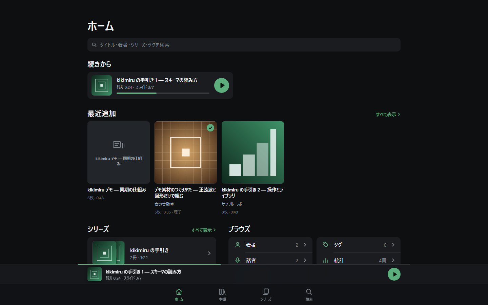
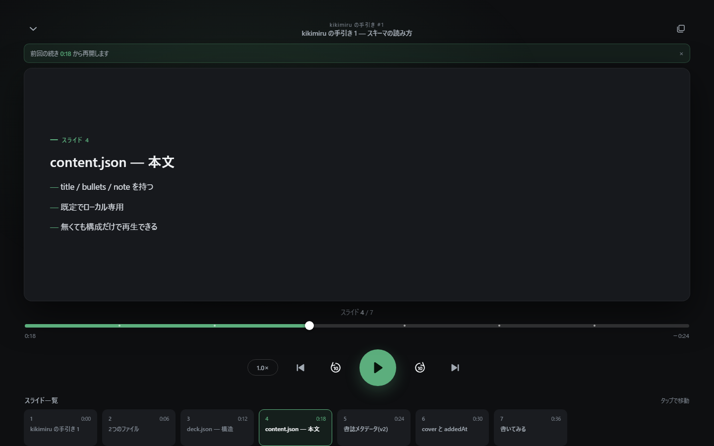
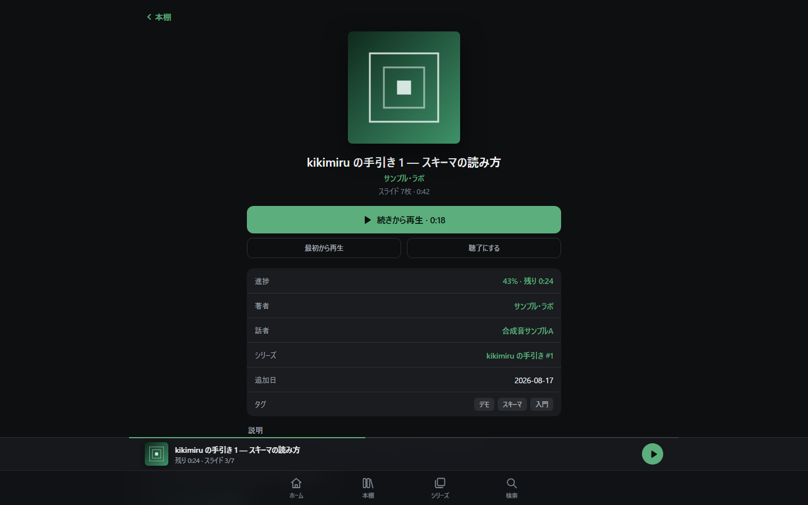
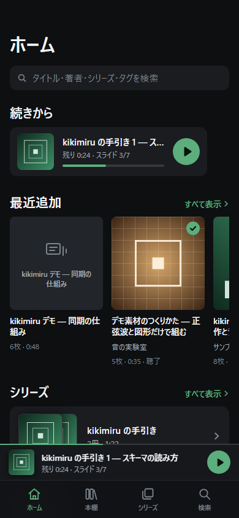

# kikimiru <sub>(working title)</sub>

**Self-hosted audio player with synchronized slides.**
Listen and watch: audio playback drives slide transitions, and tapping a slide seeks the audio.

For your own lectures, recordings, narrated tutorials, language practice, and public-domain audio.

- **No content included.** Bring your own audio and slide definitions (see [docs/SCHEMA.md](docs/SCHEMA.md)).
- **Self-host only.** A small Python server (stdlib only, HTTP Range support for mobile Safari) serves your local library. Nothing leaves your machine.
- **Structure/content separation by design.** Timing data (`deck.json`) and slide text (`content.json`) are separate files; sharing and export features only ever operate on the structure side.
- Independent implementation — contains no [Audiobookshelf](https://www.audiobookshelf.org/) code and is not affiliated with the Audiobookshelf project.

## Screenshots

*All screenshots show the bundled demo library — every cover, title and audio file is generated from scratch by [`demo/make_demo.py`](demo/make_demo.py).*



<p>


</p>


## Quickstart

The bundled demo book (`demo/library/demo-book/`) is already committed, so you can start the
server and try it right away — no ffmpeg needed:

```bash
python server/kikimiru_server.py         # serves the demo library at http://127.0.0.1:8484/
```

Open http://127.0.0.1:8484/ and pick the demo book. To use your own library:

```bash
python server/kikimiru_server.py --library /path/to/your/library
```

One folder per book: `audio.mp3` + `deck.json` (+ optional `content.json`).

Only if you want to regenerate the bundled demo from scratch (ffmpeg/ffprobe required):

```bash
python demo/make_demo.py
```

## Security

**No authentication is implemented.** If you pass a non-loopback address to `--bind` (e.g. an
IP reachable on your LAN), anyone who can reach that network can read your entire library.
Avoid binding to an untrusted network; keep the default `127.0.0.1` unless you understand the
exposure.

## Status

Phase 1 — library experience (multi-library, search, series/authors/tags, book detail, immersive player) is done. Roadmap: auth, progress sync, Docker, PWA, then native mobile apps.

## License

[AGPL-3.0](LICENSE). Contributions require the lightweight CLA described in [CONTRIBUTING.md](CONTRIBUTING.md).

---

# kikimiru(仮称)

**スライド同期機能付きの self-host 音声プレイヤー。**
音声の再生に同期してスライドが切り替わり、スライドの一覧をタップすると音声がシークします。

自作の講義録音・ナレーション付き教材・語学練習・パブリックドメイン音源のために。

- **コンテンツは同梱しません。** 音声とスライド定義はご自身で用意します([docs/SCHEMA.md](docs/SCHEMA.md))
- **self-host 専用。** Python 標準ライブラリのみの小さなサーバがローカルのライブラリを配信します(モバイル Safari のシークに必要な HTTP Range 対応)。データは手元から出ません
- **構造と本文の分離。** タイミング(`deck.json`)と本文(`content.json`)は別ファイルで、共有・書き出し機能が扱うのは常に構造側だけです
- 独立実装です — [Audiobookshelf](https://www.audiobookshelf.org/) のコードは含まず、同プロジェクトとは無関係です

## スクリーンショット

*すべて同梱デモライブラリの画面です — 表紙・タイトル・音声はいずれも [`demo/make_demo.py`](demo/make_demo.py) がゼロから生成した自作素材です。*


<p>


</p>


## 使い方

同梱デモ(`demo/library/demo-book/`)はコミット済みのため、サーバを起動するだけで
すぐ試せます。ffmpeg は不要です:

```bash
python server/kikimiru_server.py         # http://127.0.0.1:8484/ でデモを配信
```

自分のライブラリを使う場合は `--library <dir>` を指定します(1フォルダ=1ブック)。

同梱デモをゼロから作り直したい場合のみ(ffmpeg / ffprobe が必要):

```bash
python demo/make_demo.py
```

## セキュリティ

**認証は実装されていません。** `--bind` に非ループバックアドレス(LAN上のIPなど)を指定すると、
そのネットワークに到達できる全員がライブラリ全体を読めてしまいます。信頼できないネットワークへの
公開bindは避け、事情がない限り既定の `127.0.0.1` のまま使ってください。
